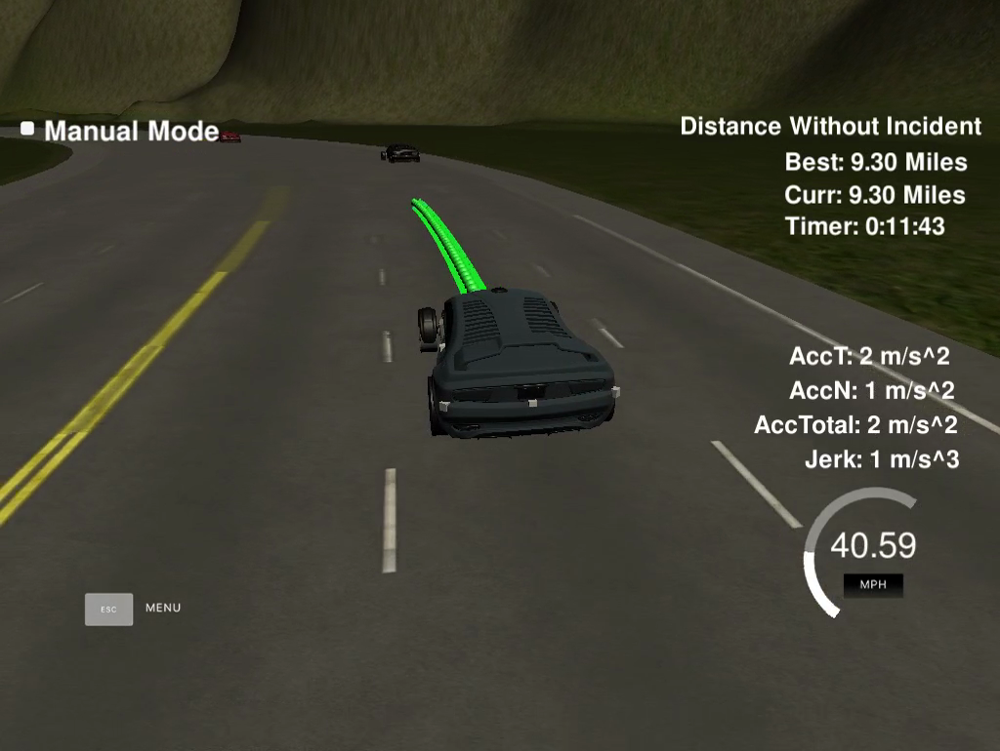

# Path Planning Project
This Project is the eleventh task of the Udacity Self-Driving Car Nanodegree program. The main goal
of the project is to design a path planner that is able to create smooth, safe paths for the car in a
simulator to follow along a 3 lane highway with traffic. And run as fast as possible, without violating
50 mph speed limit!

## Results

The car is able to drive at least 4.32 miles without incident.
The car is able to race more then 2 laps without incidents (average speed 47.83 mph). The screenshot is
presented above. Video of the run is available on [Youtube](https://youtu.be/Bh3zmHGpxK0).

## Key Ideas:
* We need to drive around the track as fast as possible, that is why a trajectory can be generated
not with minimum jerk/acceleration, but maximal.
* Use simple grid-based method to find the quasi-optimal path by maximizing cumulative speed
estimated for the path.
* After the rough path-finding, check for safety of the desired maneuvers can be applied.

## Path Planning
General path planning is done by computing position of anchor points. A local map of the road is
represented as discrete 3xN grid (3 – numbers of lanes, N – number of steps (length STEP_SIZE, 45.0
m) to consider). At each "step" the car can try to change its lane to the neighbor ones, or keep the
current. The speed at each grid cell estimated as the maximum possible speed for the given cars
configuration (see below). A linear extrapolation of the ego vehicle and other cars positions was applied
for the prediction of car configuration at each "step".

The grid cells are stored as a 3d tree (each node have three sons) of the Node objects. The tree is stored
in form of a vector of pointers to Nodes objects. Each Node keeps its correspondent lane number,
estimation of local speed for the grid cell, cumulative speed (weighted sum of speeds of the cell parents
and the current cell speed estimation) and a pointer to the parent Node.The optimal path is a reachable path with the maximum cumulative speed. Weights (variable ‘score’ in
the code) are applied to local speeds during cumulative speed calculation for punishing lane changes
and to make the leftmost lane preferable.

## Trajectory generation
Trajectory is generated by spline connection of the anchor points. Desired
speed is estimated on each step by estimation speed of the near cars in front. Actual speed to set was
calculated as the maximum possible shift of the current speed towards the desired speed with respect to
jerk/acceleration limitations. Maximal speed was estimated as the minimal
speed of cars in front in the same lane at given distance. During lane shifts speed of back cars was also
considered because it was important not no hit too fast approaching car.
Before any maneuvers suggested by described above path planner, a safety check was carried out in
order to make sure that there is enough free space for lane change. See the ‘check’ function.

## Further ideas for improvement

* The speed limit is applied with respect to s coordinate, hence, it neglects local road curvature.
That is why we were forced to set the speed limit a bit below 50 mph speed limit. It is possible
to take local road curvature into consideration in order to increase average speed on the track.
* By taking into account the local road curvature it is possible to optimize the lane in order to use
optimal trajectory (staying on the inner lane, etc).
* Sometimes, collisions may occur if the ego vehicle and any other vehicle change lane to the
same one simultaneously. It may be eliminated by improving the car policy for lane change by
taking into account cars behaviors in the third lane. There is also a space for further
improvement of speed policy.
